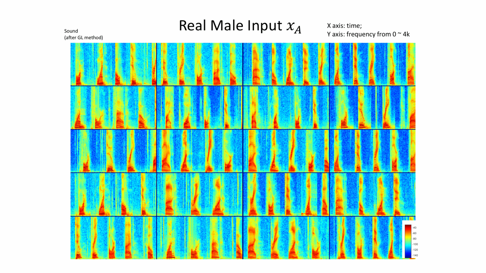
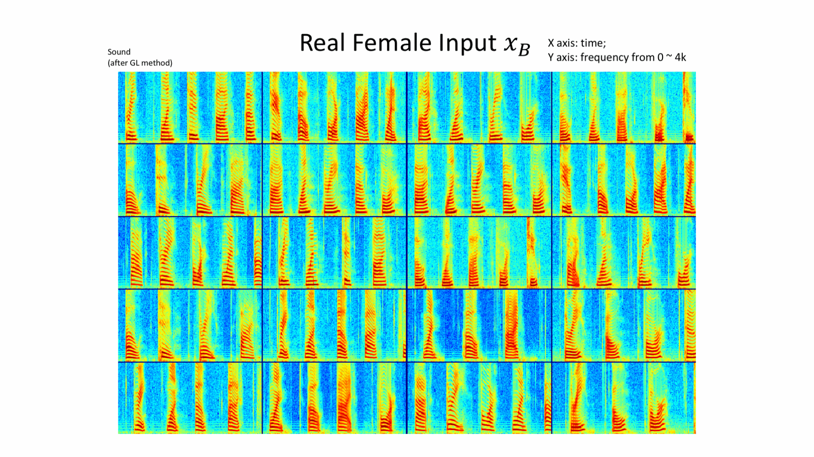

# Voice-GAN
These are the results for Spectrogram-GAN voice transformation

The speaker one is represented as A and speaker two is represented as B. 

-AB is the transformed result of convert the voice of speaker A to speaker B.  
-BA is the transformed result of convert the voice of speaker B to speaker A.  
-ABA is the twice transformed result of convert AB (the converted the voice of speaker B from speaker A) to the voice of speaker A again.  
-BAB is the twice transformed result of convert BA (the converted the voice of speaker A from speaker B) to the voice of speaker B again.  

[To listen to randomly picked results](http://nbviewer.jupyter.org/github/Yolanda-Gao/Spectrogram-GAN/blob/master/VoiceGAN%20result.ipynb?flush_cache=true)

A-AB-ABA

B-BA-BAB

